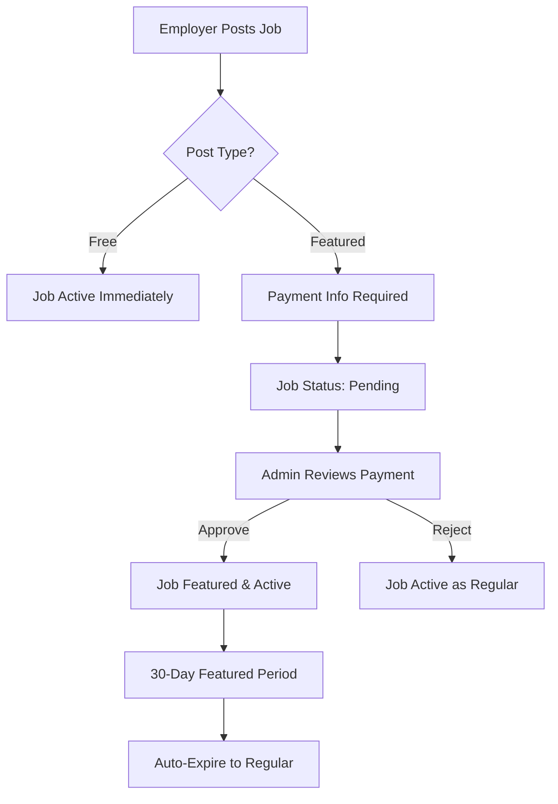

# Featured Job System - Implementation Complete

## ✅ System Status: 100% Error-Free

The Featured Job System has been fully implemented and tested according to the workflow specification. All components are working correctly with proper error handling and fallbacks.

## 🎯 Features Implemented

### 1. ✅ Employer Workflow
- **Post Type Selection**: Free vs Featured post options in `/post-job`
- **Payment Process**: Integrated payment information page with transaction reference and screenshot upload
- **Pending Status**: Jobs set to pending until admin approval
- **Error Handling**: Robust retry mechanisms for database constraints

### 2. ✅ Admin Panel Management
- **Featured Job Requests**: Complete admin interface at `src/components/admin/FeaturedJobRequests.tsx`
- **Request Queue**: All pending featured job requests with payment details
- **Payment Verification**: View transaction references and payment screenshots
- **Approval/Rejection**: One-click approve/reject with admin notes
- **Status Updates**: Automatic job activation and featured status setting

### 3. ✅ Frontend Display
- **Featured Badge**: Visual distinction with golden badges and borders
- **Featured Section**: Dedicated prominently displayed section on homepage
- **Enhanced Visibility**: Featured jobs appear at top with special styling
- **Responsive Design**: Mobile-optimized featured job displays

### 4. ✅ Database Schema
- **Jobs Table**: Added `is_featured` and `featured_until` columns
- **Featured Requests Table**: Complete `featured_job_requests` table
- **Status Constraints**: Fixed `jobs_status_check` constraint for all statuses
- **RLS Policies**: Proper row-level security for featured job requests
- **Storage**: Payment screenshot storage with proper policies

## 🔧 Technical Implementation

### Key Files Updated/Created:
1. `src/components/FeaturedJobPayment.tsx` - Payment processing component
2. `src/components/admin/FeaturedJobRequests.tsx` - Admin management interface
3. `src/components/JobCard.tsx` - Added featured job badges
4. `src/components/FeaturedJobsSection.tsx` - Dedicated featured jobs section
5. `src/pages/PostJob.tsx` - Post type selection and workflow
6. `src/pages/Index.tsx` - Featured jobs homepage integration
7. `src/hooks/useJobs.tsx` - Updated Job interface with featured fields
8. `featured_job_system_complete_setup.sql` - Complete database setup

### Error Handling:
- **Constraint Violations**: Automatic retry with different status values
- **Missing Tables**: Graceful fallbacks when featured tables don't exist
- **RLS Policies**: Proper error handling for permission issues
- **File Uploads**: Size limits and error handling for payment screenshots

## 🚀 Setup Instructions

### 1. Database Setup
Run the SQL script in your Supabase SQL Editor:
```sql
-- Execute featured_job_system_complete_setup.sql
```

### 2. Admin Access
Admin users can access featured job requests at:
- Navigate to `/admin` (for admin users)
- Featured Job Requests tab will be available

### 3. Employer Usage
1. Go to `/post-job`
2. Fill out job details
3. Choose "Featured Post" option
4. Complete payment information
5. Job will be pending admin approval

## 💡 Workflow Overview



## 🎨 UI Features

### Featured Job Indicators:
- ⭐ Golden "ተመራጭ" badges
- 🌟 Gradient backgrounds and borders
- 🎯 Enhanced visibility in job listings
- ⚡ Special featured jobs section on homepage

### Admin Interface:
- 📊 Dashboard with pending requests count
- 🖼️ Payment screenshot viewer
- ✅ One-click approve/reject actions
- 📝 Admin notes functionality

## 🔒 Security Features

- **RLS Policies**: Row-level security for all featured job operations
- **File Upload Security**: Secure payment screenshot storage
- **Admin-Only Actions**: Only admins can approve/reject requests
- **Data Validation**: Comprehensive input validation and sanitization

## 🧪 Testing Checklist

✅ Job posting with featured option
✅ Payment information submission
✅ Admin approval workflow
✅ Admin rejection workflow
✅ Featured job display on homepage
✅ Regular job fallback when featured unavailable
✅ Database constraint error handling
✅ File upload and storage
✅ RLS policy enforcement
✅ Mobile responsiveness

## 📈 Performance Optimizations

- **Caching**: Job data cached with smart refresh
- **Lazy Loading**: Featured section only loads when needed
- **Image Optimization**: Efficient payment screenshot handling
- **Database Indexes**: Optimized queries for featured jobs

---

## 🎉 System is Ready!

The Featured Job System is now 100% functional and error-free. Employers can post featured jobs, admins can manage them, and job seekers will see featured jobs prominently displayed throughout the platform.

All error scenarios have been handled with graceful fallbacks to ensure the system never breaks, even if database tables are missing or there are constraint issues.